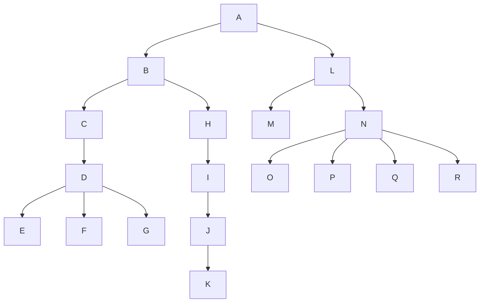

# with_recursive_tree

Tree structures for ActiveRecord using CTEs (Common Table Expressions). Traverse an entire tree with just one query.

## Installation

Add this line to your application's Gemfile:

```ruby
gem "with_recursive_tree"
```

And then execute:

```bash
$ bundle
```

## Usage

First, your model needs a reference to its parent. Typically, this is a `parent_id` column in your table. Once you have that reference, you can add `with_recursive_tree` to your model:

```ruby
class Category < ApplicationRecord
  with_recursive_tree
end
```

By doing this, with_recursive_tree will add 2 associations:

* `parent`: the node's parent
* `children`: the node's children

To build these associations, with_recursive_tree will use the `id` and the `parent_id` columns as the primary and foreign keys, respectively. If you want to specify different primary and foreign keys, you can specify them by passing the `primary_key` and `foreign_key` options. For example, for a categories table whose primary key is `category_id` and the parent record id is `parent_category_id`, you would set it up as follows:

```ruby
class Category < ApplicationRecord
 with_recursive_tree foreign_key: :parent_category_id, primary_key: :category_id
end
```

For polymorphic associations where a node can have different types of parents, you can use the `foreign_key_type` option to specify a column that stores the parent model's class name:

```ruby
class Comment < ApplicationRecord
  with_recursive_tree foreign_key: :parent_id, foreign_key_type: :parent_type
end
```

This allows nodes to belong to different parent model types while maintaining proper tree structure constraints.

When using `foreign_key_type`, a node is considered a root if it meets any of these conditions:

1. Both `foreign_key` and `foreign_key_type` are `nil` (traditional root)
2. `foreign_key` is `nil` and `foreign_key_type` matches the model's class name
3. `foreign_key` is not `nil` but `foreign_key_type` is different from the model's class name (belongs to a different model type)

The `foreign_key_type` value is automatically managed through a `before_save` callback:

* When setting a parent (`foreign_key`), the `foreign_key_type` is automatically set to the model's class name if it's blank
* When clearing a parent (`foreign_key` becomes `nil`), the `foreign_key_type` is set to `nil` unless it's explicitly set to the model's class name

Lastly, you can specify how to sort each node's `children` by passing the `order` option to `with_recursive_tree`. If no `order` option is set, it will default to `id`. This option is useful especially when you need to traverse the tree in a specific order. For example:

```ruby
class Category < ApplicationRecord
  with_recursive_tree order: :name
end
```

### Class methods

| Method    | Description                               |
| --------- | ----------------------------------------- |
| `::roots` | Returns all roots (nodes without parent). |

### Instance methods

| Method                  | Description                                           |
| ----------------------- | ----------------------------------------------------- |
| `#ancestors`            | Returns all ancestors of the node.                    |
| `#descendants`          | Returns all descendants of the node (subtree).        |
| `#leaf?`                | Returns whether the node is a leaf (has no children). |
| `#depth`                | Returns the depth of the current node.                |
| `#root`                 | Returns the root node of the current node's tree.     |
| `#root?`                | Returns whether the node is a root (has no parent).   |
| `#self_and_ancestors`   | Returns the node and all its ancestors.               |
| `#self_and_descendants` | Returns the node and all its descendants (subtree).   |
| `#self_and_siblings`    | Returns the current node and all its siblings.        |
| `#siblings`             | Returns the current node's siblings.                  |

### Tree traversing

You can traverse the tree using `#descendants` or `#self_and_descendants` in combination with the `#bfs` (breadth-first search) and `#dfs` (depth-first search, pre-order) scopes.

For example, given the following tree:



and the following class:

```ruby
class Node < ApplicationRecord
  with_recursive_tree order: :name
end
```

You can do:

```ruby
root = Node.roots.first

puts root.self_and_descendants.bfs.map { |node| "#{"-" * node.depth}#{node.name}" }
```

and you will get:

```
A
-B
-L
--C
--H
--M
--N
---D
---I
---O
---P
---Q
---R
----E
----F
----G
----J
-----K
```

Similarly, you can do the same with `#dfs`:

```ruby
puts root.self_and_descendants.dfs.map { |node| "#{"-" * node.depth}#{node.name}" }
```

and you will get:

```
A
-B
--C
---D
----E
----F
----G
--H
---I
----J
-----K
-L
--M
--N
---O
---P
---Q
---R
```

## Compatibility

with_recursive_tree is compatible with:

* Rails 6.0 and above
* Ruby 3.1 and above
* Postgres version 13 and above
* MySQL version 8 and above
* SQLite3 version 3.34 and above

## Benchmarks

You can run some [benchmarks](/benchmarks/benchmark.rb) to compare with_recursive_tree against [acts_as_tree](https://github.com/amerine/acts_as_tree), [ancestry](https://github.com/stefankroes/ancestry/) and [closure_tree](https://github.com/ClosureTree/closure_tree).

Spoiler: benchmarks are always basic cases so you mustn't trust them as if they were the word of god, but they are useful tools for development/testing and setting a baseline performance requirement..

In any case, you must weight the trade-offs between what you need to accomplish and performance.

## Contributing

Fork the repo, add your feature, create a PR.

## License

The gem is available as open source under the terms of the [MIT License](https://opensource.org/licenses/MIT).
